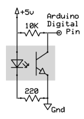
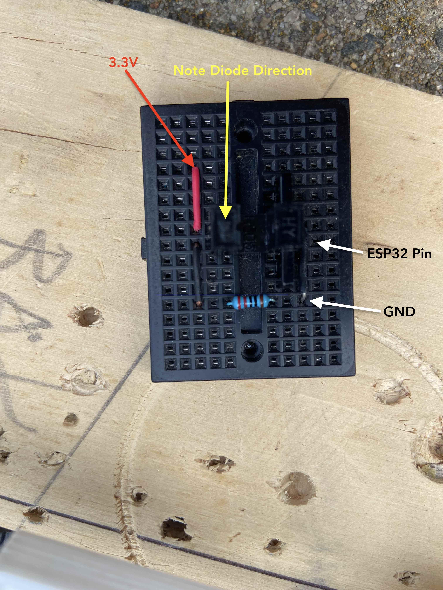

# Sensors & wiring them up

## Opto-Interruptor
- Here's a [quick tutorial](https://www.utopiamechanicus.com/article/opto-interrupter-part-3/) on how to wire up an opto-interrupter as a way to set up a limit switch.

See also the schematic 

See also the wiring picture 
